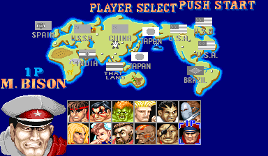
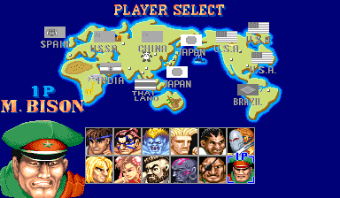
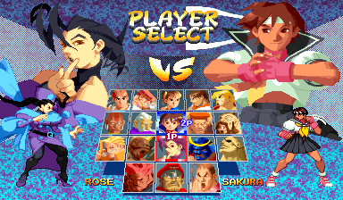

# CPS1 Swaps
HF palettes in CE and CE palettes in HF

## Getting Started
This will get you playing palette hacks on your local machine with new a new coat of paint for all characters.

### Prerequisites
 * [Fightcade 2](http://www.fightcade.com/)
 * The roms for sf2ce.zip and sf2hf.zip. You need to get these on your own.
 
### Installing

### Fightcade 2: Champion Edition
Download the latest release:
 * [Latest HF-2-CE Patch](roms/Fightcade/HF-2-CE.7z?raw=true)
 
* The HF-2-CE.7z folder contains 3 files, named s92_21a.6f, s92_22b.7f and s92e_23b.8f
* Open your fightcade 2 roms folder. Inside it is a subfolder called FBNeo Roms. 
* In FBNeo Roms, there is a file called sf2ce.zip.
* Drag the three files into sf2ce.zip. It will replace three existing files.
* Open fightcade 2. You should see the palettes after selecting the alt colour.
* Fightcade 2 will complain about CRC's being incorrect this is normal just press OK when it comes up.

 

Do not use a save state to load, as that will show the classic capcom colours.

### Fightcade 2: Hyper Fighting
Download the latest release:
 * [Latest CE-2-HF Patch](roms/Fightcade/CE-2-HF.7z?raw=true)

* The CE-2-HF.7z folder contains 3 files, named s2te_21.6f, s2te_22.7f and s2te_23.8f
* Open your fightcade 2 roms folder. Inside it is a subfolder called FBNeo Roms. 
* In FBNeo Roms, there is a file called sf2hf.zip.
* Drag the three files into sf2hf.zip. It will replace three existing files.
* Open fightcade 2. You should see the new colours on the select screen.
* Fightcade 2 will complain about CRC's being incorrect this is normal just press OK when it comes up.
 

Do not use a save state to load, as that will show the classic capcom colours.

# CPS2 Stuff

### Fightcade 2: Alpha 2
Download the latest release:
 * [Latest Alpha 2 Patch](roms/Fightcade/Alpha2.7z?raw=true)

* The Alpha2.7z folder contains 2 files, named sz2u.07, and sz2u.08
* Open your fightcade 2 roms folder. Inside it is a subfolder called FBNeo Roms. 
* In FBNeo Roms, there is a file called sfa2u.zip.
* Drag the three files into sfa2u.zip. It will replace three existing files.
* Open fightcade 2. You should see the new colours once you've picked a colour.
* Fightcade 2 will complain about CRC's being incorrect this is normal just press OK when it comes up.

 * [Palette preview for Alpha 2](roms/Fightcade/PreviewA2.7z?raw=true)

Do not use a save state to load, as that will show the classic capcom colours.
